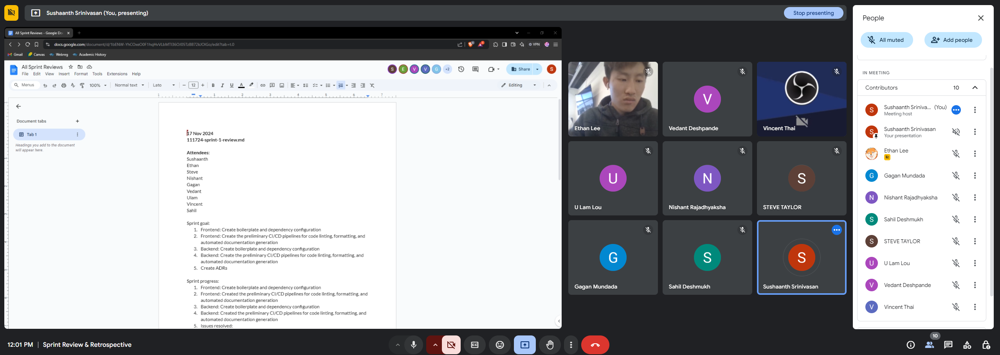

# Sprint Review Document: 17 Nov 2024

**File Name:** `111724-sprint-1-review.md`

---

## Attendees

- Sushaanth
- Ethan
- Steve
- Nishant
- Gagan
- Vedant
- Ulam
- Vincent
- Sahil

---

## Sprint Goal

### Frontend

1. Create boilerplate and dependency configuration
2. Create the preliminary CI/CD pipelines for:
   - Code linting
   - Formatting
   - Automated documentation generation.
3. Create frontend ADRs

### Backend

1. Create boilerplate and dependency configuration
2. Create the preliminary CI/CD pipelines for:
   - Code linting
   - Formatting
   - Automated documentation generation
3. Create backend ADRs

---

## Sprint Progress

### Frontend

- Created boilerplate and dependency configuration.
- Completed the preliminary CI/CD pipelines for:
  - Code linting
  - Formatting
- **Partial Completion:** Automated documentation generation pipeline created but roadblocked due to organization-related controls (workflows cannot write to the repository).

### Backend

- Created boilerplate and dependency configuration
- Completed the preliminary CI/CD pipelines for:
  - Code linting
  - Formatting
  - Automated documentation generation

---

## Issues Resolved

- **Issue #1:** Create linting and code style enforcement pipeline
- **Issue #2:** Explore methods for automatic documentation generation
- **Issue #7:** Add auto docs generation to workflow
- **Issue #8:** Create frontend boilerplate
- **Issue #9:** Create frontend boilerplate
- **Issue #10:** Backend preliminary CI/CD
- **Issue #3:** Create ADR for Electron App
- **Issue #6:** Create ADR for backend

---

## Backlog Issues to Be Resolved

- **Issue #13:** Enable workflows to write into the repository

---

## Screen Capture

